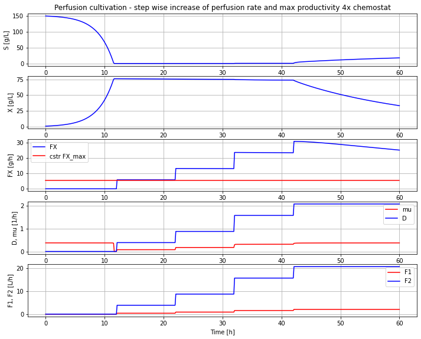

# BPL_TEST2_Perfusion

Basic example of perfusion cultivation using an FMU from Bioprocess Library *for* Modelica. 
In this notebook you see several examples of how to interact with the FMU to provide process insight.
Below script and diagram with a typical simulations of perfusion cultivation that you will get at the end of the notebook.

You start up the notebook in Colab by pressing here
[start BPL notebook](https://colab.research.google.com/github/janpeter19/BPL_TEST2_Perfusion/blob/main/BPL_TEST2_Perfusion_colab.ipynb)
or alternatively (experimentally)
[start BPL notebook with FMPy](https://github.com/janpeter19/BPL_TEST2_Perfusion/blob/main/BPL_TEST2_Perfusion_fmpy_colab.ipynb).
Then you in the menu choose Runtime/Run all. If you have chosen the altarnative with FMPy click first on the symbol Open in Colab.

The installation takes just a few minutes. The subsequent execution of the simulations of microbial growth take just a second or so. You can continue in the notebook and make new simulations and follow the examples given.

Note that:
* The script occassionaly get stuck during installation. Then just close the notebook and start from scratch.
* Remember, you need to have a google-account!

Just to be clear, no installation is done at your local computer.

License information:
* The binary-file with extension FMU is shared under the permissive MIT-license
* The other files are shared under the GPL 3.0 license
